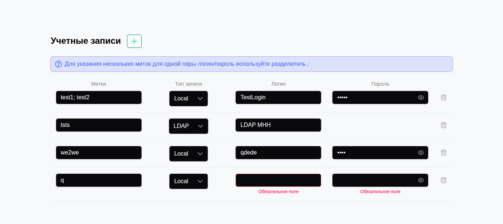

# Менеджер учетных записей (Account Manager)

🚀 **Live Demo:** [https://abayreushenov.github.io/vue3-ts-account-manager/](https://abayreushenov.github.io/vue3-ts-account-manager/)

Приложение для управления списком учетных записей с валидацией, динамическими полями и сохранением состояния.



## 🛠 Технологический стек

Проект реализован с использованием современных стандартов разработки Vue 3:

*   **Фреймворк:** [Vue.js 3](https://vuejs.org/) (Composition API, `<script setup>`)
*   **Язык:** [TypeScript](https://www.typescriptlang.org/) (Строгая типизация интерфейсов и пропсов)
*   **State Management:** [Pinia](https://pinia.vuejs.org/) (Setup Store pattern)
*   **UI Фреймворк:** [PrimeVue 4](https://primevue.org/) (Пресет Aura, Unstyled mode off)
*   **Иконки:** PrimeIcons

### Дополнительные библиотеки
*   `pinia-plugin-persistedstate` — для автоматического сохранения данных в LocalStorage.
*   `uuid` — для надежной генерации уникальных ID записей.

---

## ✅ Реализованный функционал

### 1. Структура и Данные
*   [x] Реализована типизация данных (`Account`, `LabelItem`) в TypeScript.
*   [x] **Метки:** Вводятся строкой через разделитель `;`, автоматически преобразуются в массив объектов `{ text: string }` для хранения.
*   [x] **Типы записей:**
    *   **LDAP:** Поле пароля скрывается, значение `null`.
    *   **Локальная:** Поле пароля отображается и обязательно для заполнения.

### 2. Валидация и UI
*   [x] Валидация обязательных полей (Логин, Пароль) по событию `blur`.
*   [x] Визуальное отображение ошибок (красная обводка + текст ошибки).
*   [x] Ограничение длины ввода (`maxlength`) для всех текстовых полей.
*   [x] Адаптивная верстка (на мобильных устройствах строки превращаются в карточки).

### 3. Стейт-менеджмент
*   [x] Данные хранятся в Pinia.
*   [x] Состояние персистентно (сохраняется при перезагрузке страницы).

---

## 🚀 Установка и запуск

Для работы требуется установленный Node.js.

1. **Клонирование репозитория**
```bash
   git clone https://github.com/AbayReushenov/vue3-ts-account-manager
   cd vue3-ts-account-manager
```

2. **Установка зависимостей**

```bash
npm install
```

3. **Запуск в режиме разработки**

```bash
npm run dev
```

Приложение будет доступно по адресу: `http://localhost:5173`
4. **Сборка для продакшена**

```bash
npm run build
```


---

## 📂 Структура проекта

```text
src/
├── components/
│   ├── AccountList.vue    # Главный контейнер и шапка таблицы
│   └── AccountRow.vue     # Изолированная логика строки (валидация, парсинг меток)
├── stores/
│   └── accounts.ts        # Pinia Store (CRUD операции + UUID)
├── types.ts               # TypeScript интерфейсы (Account, LabelItem)
├── App.vue                # Точка входа
└── main.ts                # Инициализация Vue, Pinia, PrimeVue
```


---

## 💡 Особенности реализации

* Использован **Setup Store** синтаксис для Pinia.
* Реализован паттерн **Smart Component** для строки таблицы (`AccountRow`), что позволяет изолировать сложную логику валидации и трансформации данных от родительского списка.

